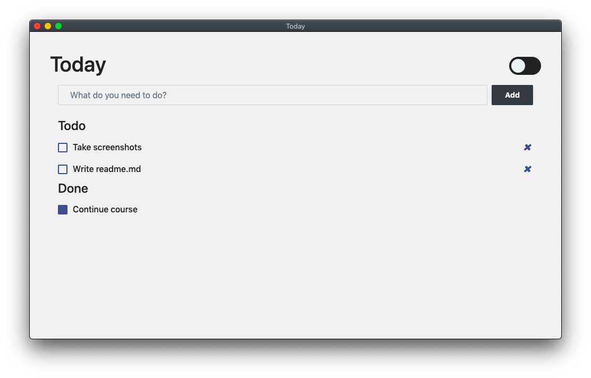

# today
### Todo desktop app built with electron.
- Saves your todo history to local storage.
- Light/dark mode
- Build scripts available in package.json
### To run, clone it and then
```
npm install
npm start
```
### Build scripts
```
npm run build:mac 
# or
npm run build:windows 
# or 
npm run build:linux
```
### Screenshots
  
